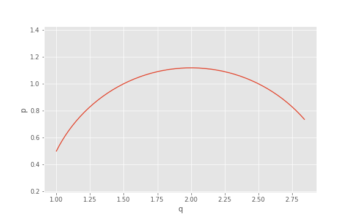

.. _tutorial_gaussian:

Forced quantum harmonic oscillator
======================================

.. sectionauthor:: Josh Izaac <josh@xanadu.ai>

Acting a Gaussian Hamiltonian defined in OpenFermion, on a continuous-variable (CV) quantum photonics simulation in Strawberry Fields, is simple with the SF-OpenFermion. In this tutorial, I will walk through a simple example using the forced quantum harmonic oscillator.

Background
----------

The Hamiltonian of the forced quantum harmonic oscillator is given by 

.. math:: \hat{H} = \frac{\p^2}{2m} + \frac{1}{2}m\omega^2 \q^2 + F\q

where

* :math:`m` is the mass of the oscillator,
* :math:`\omega` is the frequency of oscillation,
* :math:`F` is a time-independent external force.

Let's define this Hamiltonian using OpenFermion, with :math:`m=\omega=1` and :math:`F=2`:

>>> from openfermion.ops import QuadOperator, normal_ordered_quad
>>> from openfermion.utils import commutator
>>> H = QuadOperator('q0 q0', 0.5) + QuadOperator('p0 p0', 0.5) - QuadOperator('q0', 2)

In the Heisenberg picture, the time-evolution of the :math:`\q` and :math:`\p` operators is given by:

.. math::
	& \frac{d}{dt}\q = i[\hat{H}, \q] = \hbar \q\\
	& \frac{d}{dt}\p = i[\hat{H}, \q] = \hbar(F-\q)

We can double check these using OpenFermion:

>>> 1j*normal_ordered_quad(commutator(H, QuadOperator('q0')), hbar=2)
2 [p0]
>>> 1j*normal_ordered_quad(commutator(H, QuadOperator('p0')), hbar=2)
4 [] + -2 [q0]

Assuming the oscillator has initial conditions :math:`\q(0)` and :math:`\p(0)`, it is easy to solve this coupled set of linear differential analytically, giving the parametrised solution

.. math::
	&\q(t) = (\q(0)-F)\cos(\hbar t) + \p(0)\sin(\hbar t) + F\\
	&\p(t) = (F-\q(0))\sin(\hbar t) + \p(0)\cos(\hbar t)

Let's now attempt to simulate these dynamics directly in Strawberry Fields, solely from the Hamiltonian we defined above.

Strawberry Fields simulation
----------------------------

To simulate the time-propagation of the forced oscillator in StrawberryFields, we also need to import the :class:`~.GaussianPropagation` class from the SF-OpenFermion plugin:

>>> import strawberryfields as sf
>>> from strawberryfields.ops import *
>>> from Sfopenfermion.ops import GaussianPropagation

:class:`GaussianPropagation` accepts the following arguments:

* ``operator``: a bosonic Gaussian Hamiltonian, either in the form of a ``BosonOperator`` or ``QuadOperator``.

* ``t=1`` (float): the time propagation value. If not provided, default value is 1.

* ``mode`` (str): By default, ``mode='local'`` and the Hamiltonian is assumed to apply to only the applied qumodes ``(q_i, q_j,...)``.

For example, if ``QuadOperator('q0 p1') | (q[2], q[4])``, then ``q0`` acts on ``q[2]``, and ``p1`` acts on ``q[4]``.

If instead ``mode='global'``, the Hamiltonian is instead applied to the entire register by directly matching qumode numbers of the defined Hamiltonian; i.e., ``q0`` is applied to ``q[0]``, ``p1`` is applied to ``q[1]``, etc.

Let's set up the one qumode quantum circuit, propagating the forced oscillator Hamiltonian ``H`` we defined in the previous section, starting from the initial location :math:`(1,0.5)` in the phase space, for time :math:`t=1.43`:

>>> eng, q = sf.Engine(1)
>>> with eng:
...     Xgate(1) | q[0]
...     Zgate(0.5) | q[0]
...     GaussianPropagation(H, 1.43) | q

Now, we can run this simulation using the `Gaussian backend <https://strawberryfields.readthedocs.io/en/latest/code/backend.gaussian.html>`_, and output the location of the oscillator in the phase space at time :math:`t=1.43`:

>>> state = eng.run('gaussian')
>>> state.means()
array([ 3.09955704, -0.20242111])

Comparing this to the analytic solution,

.. math::
	&\braket{\q(1.43)} = (1-2)\cos(2\times 1.43) + 0.5\sin(2\times 1.43) + 2 = 3.09956,\\
	&\braket{\p(1.43)} = (2-1)\sin(2\times 1.43) + 0.5\cos(2\times 1.43) = -0.202421,

which is in good agreement with the Strawberry Fields result.

Plotting the phase space time-evolution
----------------------------------------

By using Strawberry Fields to loop over various values of :math:`t`, we can plot the phase space location of the oscillator for various values of :math:`t`.

Consider the following example:

.. code-block:: python

	eng, q = sf.Engine(1, hbar=2)

	t_vals = np.arange(0, 1, 0.02)
	results = np.zeros([2, len(t_vals)])

	for step, t in enumerate(t_vals):
	    eng.reset()
	    with eng:
	        Xgate(1) | q[0]
	        Zgate(0.5) | q[0]
	        GaussianPropagation(H, t) | q

	    state = eng.run('gaussian')
	    results[:, step] = state.means()

Here, we are looping over the same circuit as above for values of :math:`t` within the domain :math:`0\leq t<1`, and storing the resulting expectation values :math:`(\braket{\q(t)}, \braket{\p(t)})` in the array ``results``. Plotting this array in the phase space:

>>> from matplotlib import pyplot as plt
>>> plt.plot(*results)

